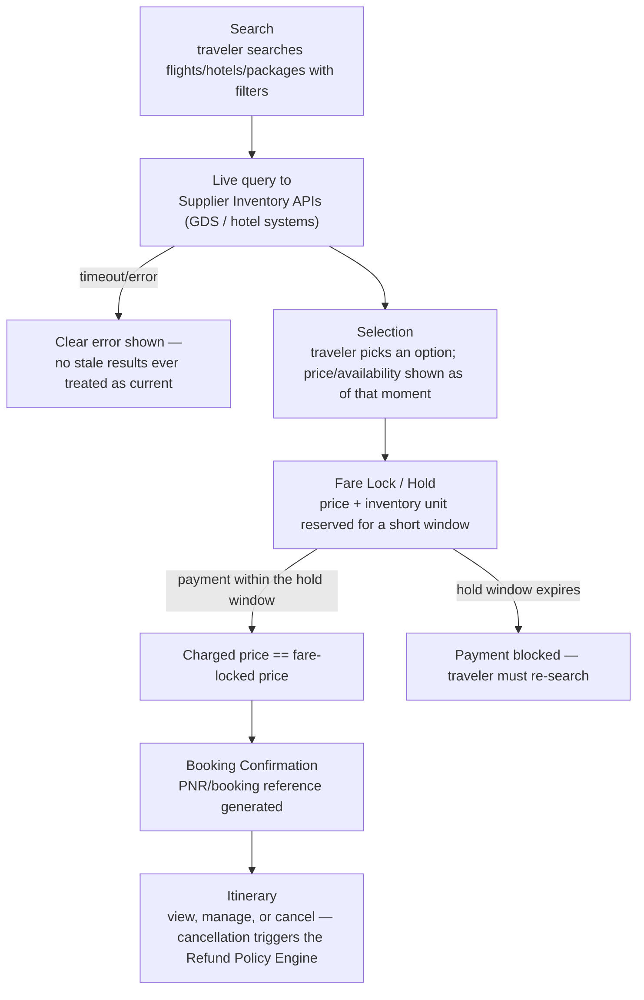

# ✈️ Travel Marketplace Platform

**A flight, hotel & package booking marketplace — QA & Automation Portfolio Project**

> This repository documents the QA strategy, test automation, and testing approach applied to a
> sample **Travel & Booking Marketplace** application that lets travelers search, compare, and
> book flights, hotels, and packages across multiple third-party suppliers through one unified
> interface.
>
> All content here uses **generic/sample data only**. No client names, company names, or
> confidential/production information are included. Dates and timelines are placeholders —
> update `[Timeline]` before publishing.
>
> 📍 **New here?** [`docs/README.md`](./docs/README.md) is a documentation map answering "what is
> this, how does it work, who's involved, what does it depend on" — with a recommended reading
> order through every doc in this repo.

---

## 📖 Table of Contents

1. [What is a Travel Marketplace?](#-what-is-a-travel-marketplace)
2. [My Role](#-my-role)
3. [Tech Stack & Tools Used](#-tech-stack--tools-used)
4. [Types of Testing Performed](#-types-of-testing-performed)
5. [How It Works — Search-to-Booking Flow](#-how-it-works--search-to-booking-flow)
6. [Key Achievements](#-key-achievements)
7. [Automation Approach](#-automation-approach)
8. [Regression Checklist](#-regression-checklist)
9. [Screenshots & Reports](#-screenshots--reports)
10. [Repository Structure](#-repository-structure)

> Deeper dives not covered inline in this README: [Modules, Submodules & Stakeholders](./docs/business-overview.md),
> [Architecture, Flow & Real Sequence Diagrams](./docs/architecture-and-flow.md),
> [Full Tech Stack & Skills Demonstrated](./docs/tech-and-skills.md), [UI Consistency](./docs/ui-consistency.md)
> — see [`docs/README.md`](./docs/README.md) for the full map. **Every diagram in this repo is
> drawn in Mermaid and renders natively right here on GitHub — nothing requires visiting another
> site.**

---

## 💡 What is a Travel Marketplace?

A **Travel Marketplace** lets a traveler search, compare, and book flights, hotels, and packages
across many third-party suppliers (airlines, hotels, travel operators) through one unified
interface, instead of checking each supplier's own site individually.

If you're new to fintech/travel-tech QA, HR, or any non-technical role: think of it as a single
storefront reselling inventory it doesn't own — the platform's core testing challenge is that
**prices and availability are controlled by external suppliers and can change at any moment**,
so the platform must guarantee what a traveler is quoted is exactly what they're charged, and that
two travelers can never both "win" the same last seat or room.

### Core Flow

1. **Search** — traveler searches flights/hotels/packages with filters
2. **Selection** — traveler picks an option; price and availability shown as of that moment
3. **Fare Lock / Hold** — the selected price and inventory unit are held for a short window
4. **Payment** — traveler pays; the platform must charge exactly the fare-locked price
5. **Booking Confirmation** — a PNR/booking reference is generated
6. **Itinerary** — traveler can view, manage, or cancel the booking afterward

### Who typically interacts with it?

| Role | What they do |
|---|---|
| **Traveler / Customer** | Searches, books, pays, manages, and cancels their own bookings |
| **Travel Partner / Supplier** | Provides real-time inventory and pricing; fulfills the booking |
| **Platform Admin/Ops** | Manages supplier onboarding, monitors booking-success rates |

---

## 👤 My Role

QA Engineer / SDET responsible for the Travel Marketplace module, owning manual and automated
test coverage across search accuracy, fare-lock integrity, and overbooking prevention.

- Owned QA strategy for the search → fare lock → payment → confirmation → cancellation journey
- Designed and executed automation covering fare-lock timing and concurrent-booking scenarios
- Performed **API testing** validating fare-lock responses, payment payloads, and booking
  confirmations against supplier-side behavior
- Focused test design on **price/availability integrity** — a category of defect largely rooted
  in external supplier systems, but still the platform's responsibility to guard against
- Logged, triaged, and tracked defects through their full lifecycle

**Timeline:** `[Add Duration]`

---

## 🛠 Tech Stack & Tools Used

| Category | Tools |
|---|---|
| **UI Automation** | Cypress, JavaScript |
| **API Testing & Automation** | Postman, Cypress `cy.intercept`-based contract assertions |
| **Performance/Concurrency Testing** | k6 |
| **Bug Tracking** | JIRA |
| **Version Control** | Git, GitHub |

> Full detail on *why* each tool was chosen for this specific product's risk profile, plus a
> skill → proof map and the performance/concurrency testing approach in depth:
> [`docs/tech-and-skills.md`](./docs/tech-and-skills.md).

---

## 🧪 Types of Testing Performed

- **Functional Testing** — search, selection, fare lock, payment, cancellation
- **Regression Testing** — full search-to-cancellation suite run before every release
- **API Testing** — search responses, fare-lock payloads, booking confirmations
- **Negative Testing** — supplier timeout during search, stale price at payment time, expired
  fare lock
- **Concurrency Testing** — simultaneous booking attempts on the same limited inventory unit,
  validated with k6 (see [`docs/architecture-and-flow.md`](./docs/architecture-and-flow.md)
  section 5 for the exact race condition, and
  [`docs/tech-and-skills.md`](./docs/tech-and-skills.md) section 5 for load/spike/soak testing
  applied to this specific product)
- **Performance/Load Testing** — search-traffic load and spike scenarios (booking demand is
  notably bursty — fare-drop alerts and seasonal surges)
- **Cross-Browser Testing**
- **Smoke & Sanity Testing** — post-deployment health checks

---

## 🔄 How It Works — Search-to-Booking Flow



**Key testing principle:** the amount charged at payment time must always match the fare-locked
price shown at selection time, and only one traveler can ever successfully confirm a booking
against a given limited inventory unit — see
[`docs/business-overview.md`](./docs/business-overview.md) section 4 for the full rationale, and
[`docs/architecture-and-flow.md`](./docs/architecture-and-flow.md) for the full set of sequence
diagrams (search, fare-lock, payment, the overbooking race condition itself, and
cancellation/refund) showing exactly how each step is enforced.

### Admin Functions

- Supplier onboarding & inventory feed integration
- Booking-success rate monitoring
- Refund policy configuration
- Reports

---

## 🏆 Key Achievements

- Designed a search-to-booking regression suite treating **price/availability integrity**
  (stale pricing, overbooking) as first-class test scenarios rather than edge cases
- Built a concurrency test approach (via k6) specifically to catch overbooking defects that
  sequential UI testing alone cannot reproduce
- Validated cancellation/refund accuracy against fare-type-specific policy tiers
- Logged and tracked defects across fare-lock timing and overbooking-prevention themes

---

## 🤖 Automation Approach

Automation is built with **Cypress + JavaScript**, backed by Postman API coverage and k6 for
concurrency scenarios.

### Priority Automated Scenarios

1. Search happy path (flights and hotels)
2. Fare lock → payment → booking confirmation
3. Payment blocked after hold expiry
4. Cancellation → refund quote → refund processed
5. Overbooking prevention (concurrent booking simulation)

See [`automation/`](./automation) for the framework README and a sample spec file using dummy
data.

---

## ✅ Regression Checklist

- [ ] Search & Discovery (flights / hotels / packages)
- [ ] Fare Lock & Booking
- [ ] Overbooking Prevention (concurrent booking race conditions)
- [ ] Cancellation & Refund
- [ ] Itinerary Management
- [ ] Payment Gateway Integration
- [ ] UI Consistency (status labeling, price formatting, terminology, accessibility)

Full checklist with edge cases available in [`regression-checklist.md`](./regression-checklist.md).

---

## 📸 Screenshots & Reports

Sample test execution reports and defect report templates are available in
[`regression-execution-summary.md`](./regression-execution-summary.md) and
[`sample-defect-report.md`](./sample-defect-report.md).

---

## 📁 Repository Structure

> **New here?** Start with [`docs/README.md`](./docs/README.md) — a documentation map that
> answers "what is this, how does it work, who's involved, what does it depend on" and points to
> exactly the right doc for each question.

```
travel-marketplace-platform/
├── README.md
├── regression-checklist.md          → Full regression suite + edge cases
├── sample-defect-report.md          → Defect theme taxonomy + worked defect examples
├── regression-execution-summary.md  → Sample regression test execution report
├── docs/
│   ├── README.md                    → 📍 Documentation map — start here
│   ├── business-overview.md         → What this is, modules/submodules, stakeholders, dependencies, glossary, price-integrity risk model
│   ├── architecture-and-flow.md     → Real Mermaid sequence/flow diagrams: search, fare-lock, payment, overbooking race condition, cancellation/refund
│   ├── tech-and-skills.md           → Full tech stack (with why), skill → proof map, testing pyramid, CI/CD shape, performance/concurrency depth
│   └── ui-consistency.md            → Cross-screen UI/UX consistency (booking status, price formatting, a11y)
└── automation/
    ├── README.md                    → Framework setup & structure
    └── sample-booking-flow.spec.ts  → Sample Cypress test (dummy data)
```

> **Note on structure:** `bug-reports/`, `test-cases/`, and `test-reports/` were originally empty
> placeholder folders — flattened away entirely once real content was added, since a folder
> holding exactly one file (or none) adds navigation overhead without organizing anything. `docs/`
> and `automation/` remain folders because each genuinely groups multiple related files.
