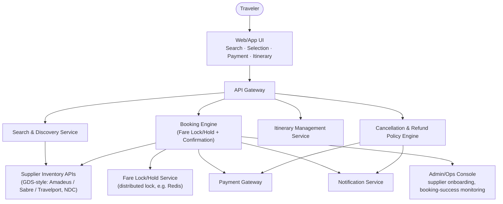
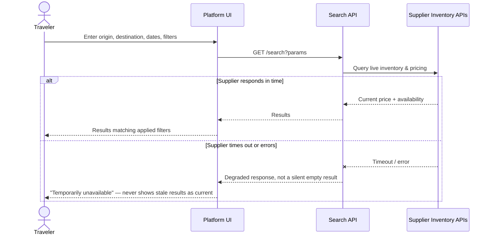
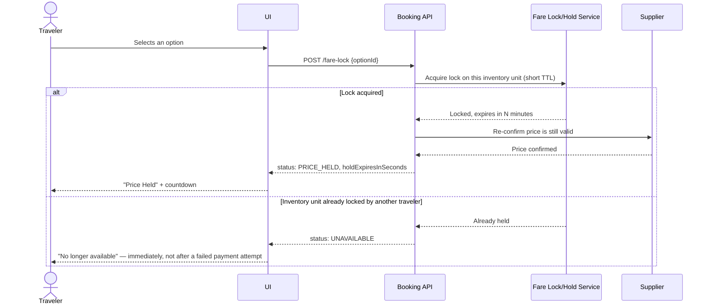
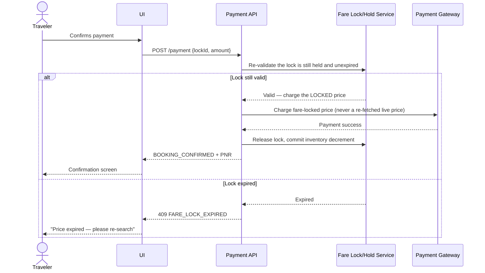
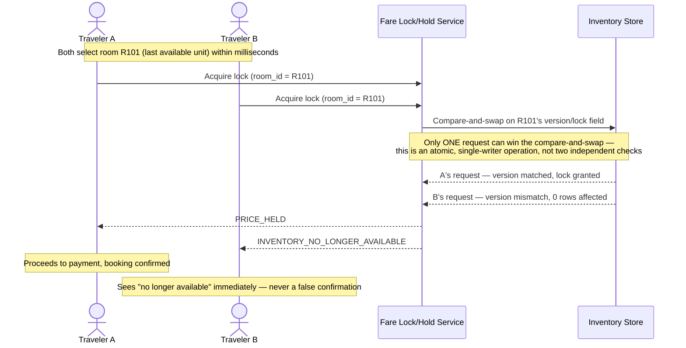
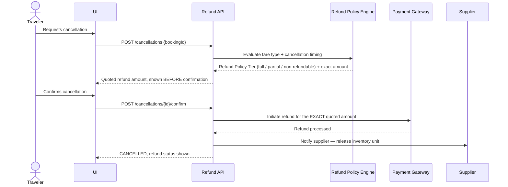

# Travel Marketplace Platform — Architecture & Flow

> See [`business-overview.md`](./business-overview.md) for why price/availability integrity is
> this product's central risk, [`tech-and-skills.md`](./tech-and-skills.md) for the tools and
> skills behind this testing approach, and [`README.md`](./README.md) for the full documentation
> map.
>
> Every diagram below is drawn in [Mermaid](https://mermaid.js.org/), which GitHub renders
> natively in-page — nothing here requires opening another site or tool to read.

## 1. System Architecture — Who Talks to Whom

**Why the Fare Lock/Hold Service is drawn as its own box, not folded into the Booking Engine:**
per [`business-overview.md`](./business-overview.md) section 6, it's the single most
load-bearing internal dependency in the whole platform — every other guarantee this product
makes (no stale pricing, no overbooking) is enforced *inside* this one component. Testing it in
isolation, not just through the Booking Engine's happy path, is why it gets its own diagrams
below rather than one line in a bigger flow.

## 2. Search Flow

**Key testing principle:** a supplier timeout and a genuine "no matching results" are different
system states with different correct UI responses (TC-003 vs. TC-004 in
[`regression-checklist.md`](../regression-checklist.md)) — collapsing both into one generic empty
state hides a real outage behind what looks like an ordinary search with no matches.

## 3. Fare Lock / Hold Flow

**Why the lock is acquired *before* re-confirming price with the supplier, not after:** if two
travelers reach this endpoint within milliseconds of each other, whoever loses the lock
acquisition must be told "unavailable" immediately — checking price first and locking second
would let both travelers see a valid price and proceed toward payment before either one
discovers a conflict, which is a worse experience and a wider window for the exact overbooking
defect this platform is built to prevent (section 5 below).

## 4. Payment Flow

**Key testing principle:** the expiry check in the diagram above happens **server-side, inside
the Payment API**, not by trusting the client's own countdown timer. [`sample-defect-report.md`
Defect #2](../sample-defect-report.md) is exactly what happens when this check is only
client-side: the countdown visually expires, but a payment submitted right after it still
succeeds at the stale price, because nothing on the server actually re-checked the lock before
charging. A UI countdown is a courtesy to the traveler — it is never the enforcement mechanism.

## 5. Overbooking Prevention — The Race Condition, Shown Directly

This is the platform's single highest-priority testing scenario
([`regression-checklist.md`](../regression-checklist.md) section 3, `TC-009`/`TC-010`), so it
gets its own diagram rather than a bullet point. Two travelers select the **same last-available**
room or seat within milliseconds of each other:

### Two real implementation patterns this diagram is deliberately generic over

`sample-defect-report.md` Defect #1's root cause was a lock check that ran only at *selection*
time and was never re-verified atomically at *confirmation* time — which is exactly the gap
between the two `alt` branches in section 3's diagram above, if that re-check is missing. There
are two well-established, genuinely different ways to close that gap, and a real implementation
picks one deliberately rather than by accident:

| Pattern | How It Works | Trade-off |
|---|---|---|
| **Distributed lock** (e.g., Redis `SETNX`/Redlock) | The first request to successfully set a lock key for that inventory unit wins; the lock is held only for the brief window needed to commit the decrement (well under a second), then released | Simple to reason about; requires a highly-available lock store, since the lock store itself becomes a single point of correctness |
| **Optimistic concurrency control** (a version/CAS field on the inventory row) | Every update includes the version it last read; the database update only succeeds if the version still matches. A losing request's update affects zero rows and fails cleanly, with no lock ever explicitly held | No separate lock infrastructure needed; requires every write path to the inventory table to consistently check the version, with no shortcut that bypasses it |

Both patterns solve the same problem the diagram shows — turning "two requests race for one
unit" into "exactly one request can ever win," atomically, at the database or lock-store level,
never as two sequential application-level checks that a fast-enough second request can slip
between.

<em>⚠ Not to be confused with intentional overbooking</em>

> **A note this platform's QA strategy has to be explicit about:** some real airlines and hotels
> *deliberately* overbook by a small, configured margin (commonly cited around 5–10%), betting on
> a predictable rate of no-shows and cancellations — that's a revenue strategy, decided by
> Admin/Ops, and modeled as an intentional threshold in the inventory system. The overbooking
> **defect** this document's diagram exists to prevent is different in kind: it's the platform
> confirming *more* bookings than even that configured, intended threshold allows, because a race
> condition let two requests both win. Testing this module means verifying the *unintentional*
> case is structurally impossible — not verifying that overbooking never happens at all, which
> would actually be testing the wrong thing on a platform that supports the configured-margin
> strategy.

## 6. Cancellation & Refund Flow

**Key testing principle:** the amount shown at the quote step and the amount actually refunded
must be the identical figure — no re-evaluation of the policy tier between "traveler saw the
quote" and "traveler confirmed" (`TC-011`/`TC-012`). If the policy genuinely needs to change
(e.g., a promotional refund-policy override), that has to happen *before* a quote is shown, never
silently between quote and confirmation.

## 7. Why Overbooking Prevention Is a Concurrency Testing Problem, Not Just a Functional One

Section 5's diagram is the concrete version of this point: a standard *sequential* functional
test — book the room, then try to book it again — can never reproduce this defect class, because
sequential requests never actually race. Only a test that deliberately fires two (or more)
requests at the same inventory unit **simultaneously** can exercise the compare-and-swap/lock
path at all. This is exactly why this platform's automation strategy uses k6 specifically for
this one scenario rather than trying to force Cypress (a browser-driven, inherently sequential
tool) to simulate it — see [`tech-and-skills.md`](./tech-and-skills.md) section 5 for the full
performance/concurrency testing approach.

---

**Sources for the real-world architecture patterns referenced above** (used to ground this
document's diagrams in genuine industry practice, not invented mechanics):
[GDS market structure — AltexSoft](https://www.altexsoft.com/blog/travelport-vs-amadeus-vs-sabre-gds/),
[NDC standard — AppMatic](https://appmatictech.com/insights/gds-api-integration-travel-tech/),
[Distributed locks & optimistic concurrency for booking systems — Aiosell](https://aiosell.com/blog/prevent-overbookings/).
