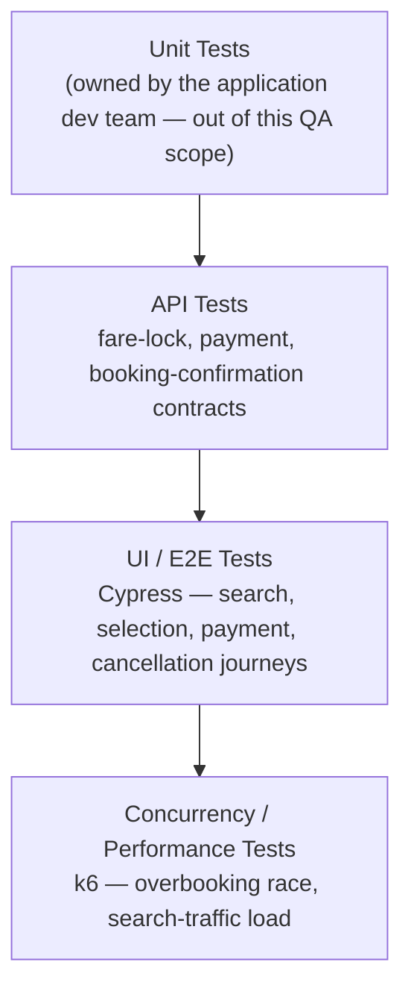
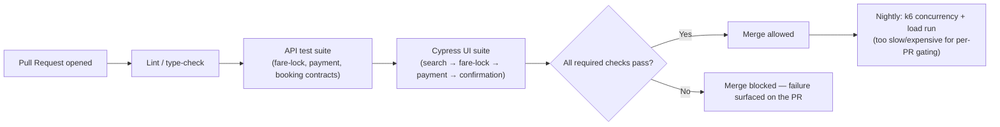

# Travel Marketplace Platform — Tech Stack & Skills Demonstrated

> Everything in this doc is answerable by reading this repo alone — no need to visit an external
> site to understand what was used or why. See [`business-overview.md`](./business-overview.md)
> for the product/module breakdown and [`architecture-and-flow.md`](./architecture-and-flow.md)
> for how the system actually behaves.

## 1. Full Tech Stack, and Why Each Tool

| Category | Tool | Why This Tool Specifically |
|---|---|---|
| **UI Automation** | Cypress + JavaScript | Fast, browser-native execution with built-in network interception (`cy.intercept`) — essential here specifically because fare-lock and payment responses need to be mocked deterministically (Section 2 below) rather than depending on a real, ever-changing supplier |
| **API Testing & Automation** | Postman (design/exploration) + Cypress's own request/intercept layer (automated assertions) | Postman for exploring and documenting the fare-lock/payment/booking-confirmation contract by hand first; the automated assertions against that same contract live inside the Cypress suite (see [`../automation/`](../automation)) so API correctness is checked on every run, not just manually |
| **Performance / Concurrency Testing** | k6 | The only tool in this stack actually capable of firing two requests at the same inventory unit *simultaneously* — see section 5 below for why this is not a job a browser-driven UI tool can do |
| **Bug Tracking** | JIRA | Full defect lifecycle tracking — see [`../sample-defect-report.md`](../sample-defect-report.md) for the report shape used |
| **Version Control** | Git, GitHub | This repo itself; diagrams throughout are Mermaid, which GitHub renders natively with zero extra tooling |

## 2. Skills Demonstrated — Skill → Where to See It

A quick map for anyone scanning this repo for a specific skill, rather than reading it top to
bottom:

| Skill | Demonstrated By | Where to Look |
|---|---|---|
| **Manual / Functional Test Design** | Full search-to-cancellation test case suite, with explicit expected results per scenario | [`../regression-checklist.md`](../regression-checklist.md) |
| **API Testing** | Contract-level validation of fare-lock, payment, and booking-confirmation responses — including negative cases (expired lock, declined payment) | [`../regression-checklist.md`](../regression-checklist.md) sections 2–4; API-level assertions inside [`../automation/sample-booking-flow.spec.ts`](../automation/sample-booking-flow.spec.ts) |
| **UI Automation** | Cypress spec covering search, fare-lock, expired-payment, and overbooking-outcome scenarios against mocked responses | [`../automation/sample-booking-flow.spec.ts`](../automation/sample-booking-flow.spec.ts) |
| **API Automation** | The same spec's `cy.intercept` usage doubles as automated API-contract verification — asserting the UI reacts correctly to specific API response shapes, not just that a button click "works" | [`../automation/sample-booking-flow.spec.ts`](../automation/sample-booking-flow.spec.ts) |
| **Performance / Concurrency / Load Testing** | k6-based simulation of the overbooking race condition, plus the load-testing approach for search-traffic spikes | Section 5 below; [`architecture-and-flow.md`](./architecture-and-flow.md) section 5; [`../automation/README.md`](../automation/README.md) |
| **Regression Strategy & Prioritization** | A structured, risk-ranked regression suite with an explicit "highest priority" section (overbooking) rather than a flat, unordered list | [`../regression-checklist.md`](../regression-checklist.md) |
| **Defect Management & Root-Cause Analysis** | Worked defect reports that go past "it's broken" into the actual mechanism (e.g., "expiry check only runs client-side") and a concrete suggested fix | [`../sample-defect-report.md`](../sample-defect-report.md) |
| **Test Reporting & Metrics** | A structured execution summary with pass/fail breakdown by area and a written conclusion tying results back to QA strategy | [`../regression-execution-summary.md`](../regression-execution-summary.md) |
| **Technical Documentation & Communication** | This entire `docs/` set — explaining not just *what* was tested but *why*, for a reader with no prior context on the product | This doc set, start to finish |

## 3. The Testing Pyramid Applied to This Project



**Why concurrency/performance sits at the top, not because it's "extra," but because it's the
narrowest, most expensive layer to run:** per
[`architecture-and-flow.md`](./architecture-and-flow.md) section 7, this layer exists to catch a
defect class (race conditions) that every layer below it structurally cannot reproduce, no matter
how thorough — a sequential functional test, however well-designed, never actually races two
requests against each other. It's placed last in priority-of-volume (fewest tests, run least
often) but not last in importance — `TC-009`/`TC-010` in
[`regression-checklist.md`](../regression-checklist.md) are explicitly marked highest priority
despite living in the smallest, slowest layer of this pyramid.

## 4. CI/CD — Suggested Pipeline Shape

> **Note on scope, matching this repo's existing honesty convention** (see
> [`../automation/README.md`](../automation/README.md)): this repo includes one representative
> Cypress spec rather than a full framework, to stay focused as a portfolio piece. The pipeline
> below is the **intended shape** this automation is designed to slot into, documented so the
> design intent is clear — it is not a claim that a live Jenkins/GitHub Actions instance is
> currently wired up in this repo.



**Why the k6 concurrency run is nightly, not per-PR:** it's the most expensive layer in section
3's pyramid — gating every single PR on it would slow down the team's whole merge cadence for a
defect class that, once the Fare Lock/Hold Service's locking mechanism is correct, doesn't
regress often. A nightly run still catches a regression within 24 hours, which is an acceptable
trade-off between feedback speed and infrastructure cost for this specific test category — the
same reasoning a real team would use to decide gate-every-PR vs. scheduled for any expensive test
suite.

## 5. Performance & Concurrency Testing, In Depth

This project's performance testing isn't generic "how fast does the page load" — it's targeted
at the two places where this specific product's architecture is actually at risk:

| Test Type | What It Targets | Why It Matters Here Specifically |
|---|---|---|
| **Concurrency / race-condition test** | Two (or more) simultaneous fare-lock requests against the same inventory unit | This *is* the overbooking-prevention test — see [`architecture-and-flow.md`](./architecture-and-flow.md) section 5 for the exact mechanism (distributed lock or optimistic concurrency) being validated |
| **Load test** | Sustained search traffic at an expected peak volume (e.g., a seasonal booking surge) | Search is the highest-traffic, most frequently-hit endpoint in the whole platform — a slow search response is the first thing a traveler experiences, and search load is what precedes any booking at all |
| **Spike test** | A sudden, sharp jump in search/booking traffic (e.g., a flash sale or fare-drop alert) | Travel demand is famously bursty — a fare-drop notification can send a large fraction of a mailing list searching within the same few minutes, a very different load shape than steady traffic |
| **Soak test** | Sustained moderate load over hours | Catches slow degradation (connection pool exhaustion, memory growth) that a short burst test can't reveal — relevant for the Fare Lock/Hold Service specifically, since a leaking lock that never properly expires would only show up under sustained load, not a quick smoke test |

**A concrete, illustrative k6 concurrency scenario** — matching the sequence diagram in
[`architecture-and-flow.md`](./architecture-and-flow.md) section 5:

```javascript
// k6/concurrent-booking-race.js — illustrative shape, dummy data only
import http from 'k6/http';
import { check } from 'k6';

export const options = {
  scenarios: {
    race_same_inventory_unit: {
      executor: 'shared-iterations',
      vus: 2,            // exactly 2 virtual users...
      iterations: 2,      // ...each firing exactly once, at the same instant
      maxDuration: '5s',
    },
  },
};

export default function () {
  const res = http.post('https://demo-env/api/fare-lock', JSON.stringify({
    inventoryUnitId: 'ROOM-R101-DUMMY', // the same last-available unit, for both VUs
  }), { headers: { 'Content-Type': 'application/json' } });

  check(res, {
    'exactly one of the two requests is PRICE_HELD': (r) =>
      r.json('status') === 'PRICE_HELD' || r.json('status') === 'UNAVAILABLE',
  });
}
```

**What this script is actually proving:** across many runs, summing results across the whole
scenario, `PRICE_HELD` should be returned **exactly once** per inventory unit and `UNAVAILABLE`
for every other concurrent attempt — never both `PRICE_HELD`, which would be the overbooking
defect happening live under test, and never both `UNAVAILABLE`, which would mean the lock is
failing closed and blocking legitimate bookings unnecessarily.

## 6. Real-World Grounding — Industry Context

This project's architecture and terminology are deliberately grounded in how real travel-tech
systems work, not invented for the portfolio:

- **GDS landscape:** Amadeus, Sabre, and Travelport together handle an estimated ~97% of
  GDS-mediated airline distribution — a real integration in this space almost always means
  connecting to one or more of these three, not building direct per-airline integrations.
- **NDC (New Distribution Capability):** IATA's XML standard for richer airline content
  distribution, gradually supplementing the older EDIFACT message format.
- **Concurrency control for inventory systems:** the distributed-lock and optimistic-concurrency
  patterns referenced in [`architecture-and-flow.md`](./architecture-and-flow.md) section 5 are
  the same two patterns real channel-management and booking-inventory systems use in production,
  not simplified for this portfolio.

**Sources:**
[GDS market structure — AltexSoft](https://www.altexsoft.com/blog/travelport-vs-amadeus-vs-sabre-gds/),
[NDC standard — AppMatic](https://appmatictech.com/insights/gds-api-integration-travel-tech/),
[Distributed locks & optimistic concurrency for booking systems — Aiosell](https://aiosell.com/blog/prevent-overbookings/).
